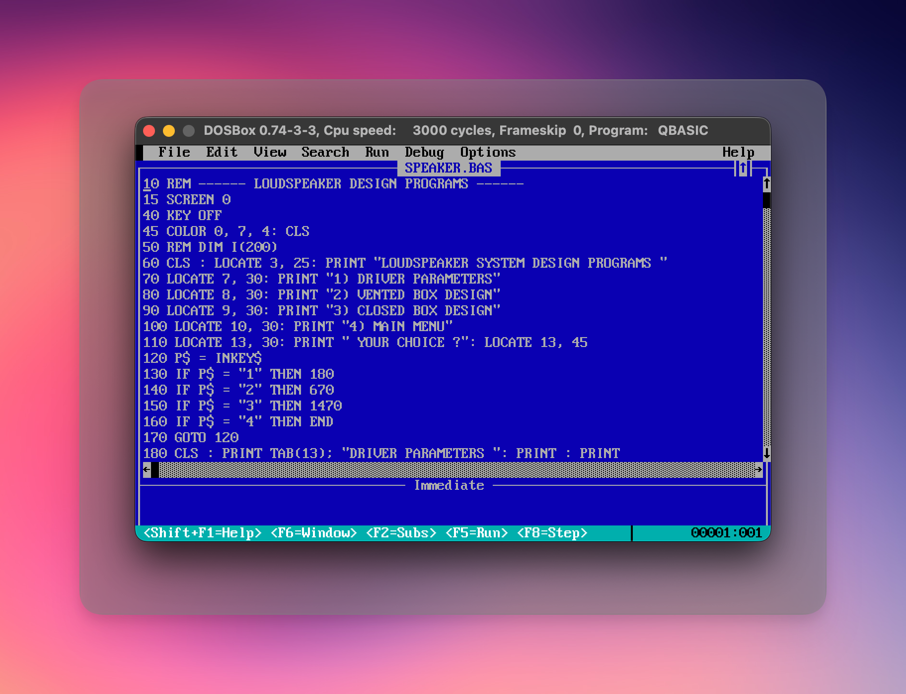
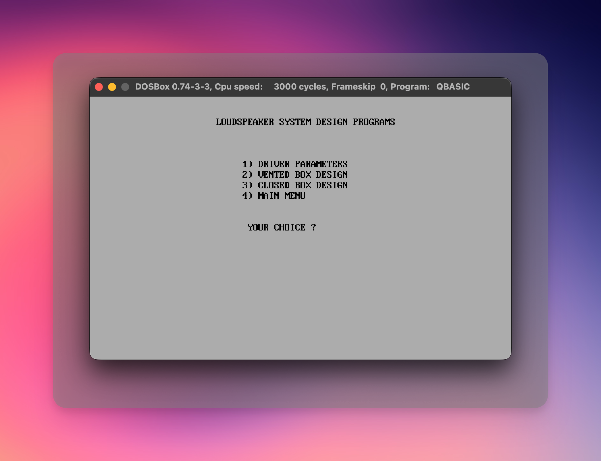
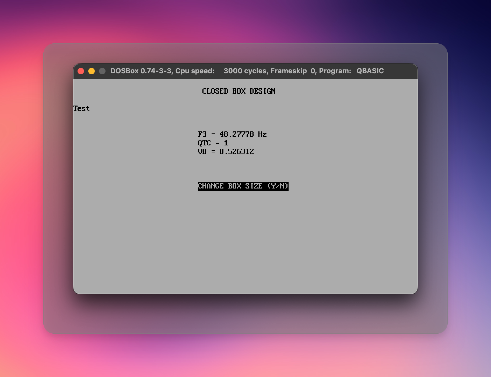
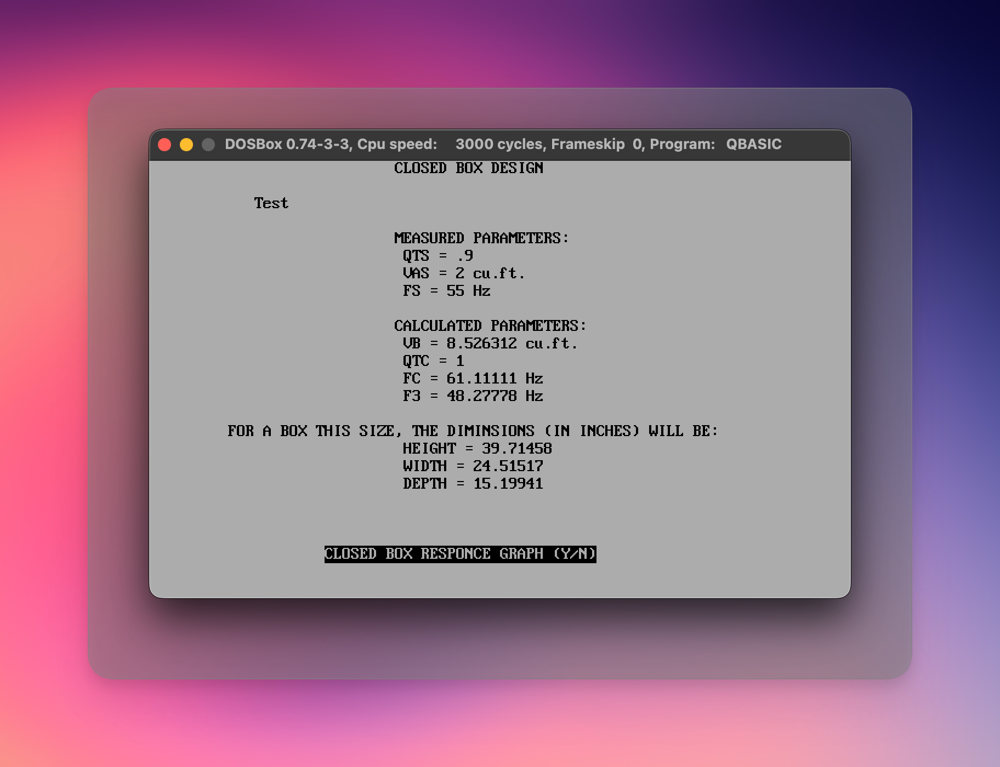
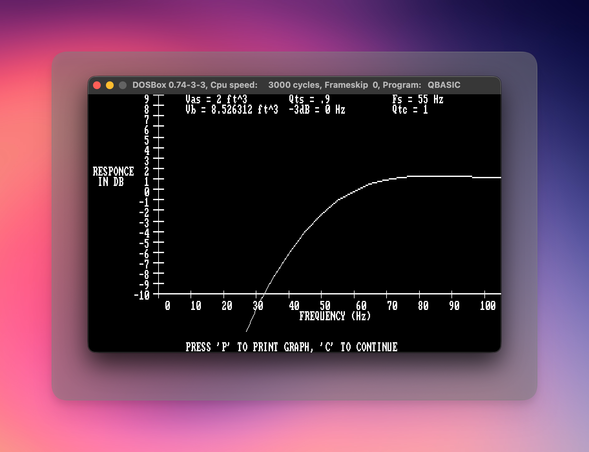
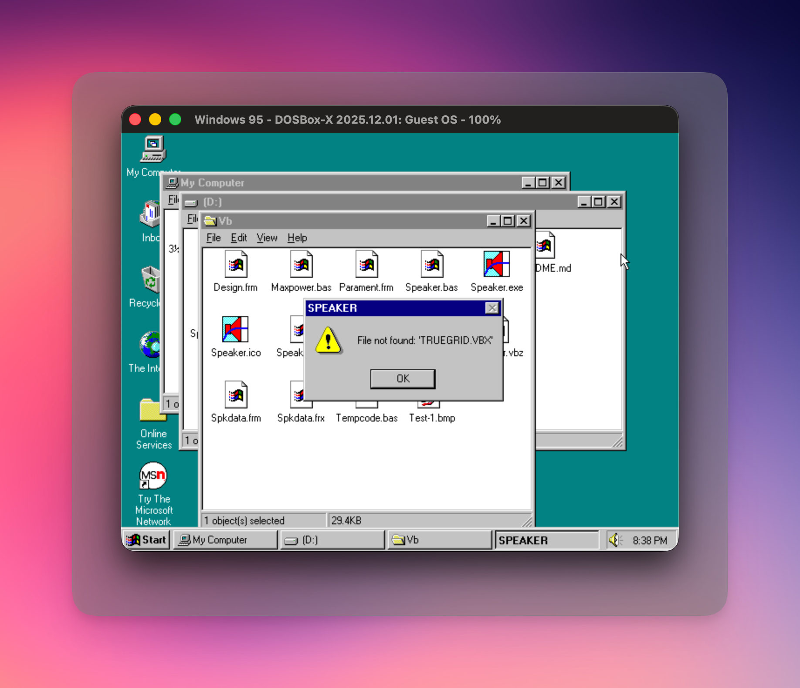

# Loudspeaker Design Programs

This repository contains source code to help design **loudspeaker enclosures**. It contains two versions of the application. The first is the original MS-DOS application written in BASIC, and the second is a GUI version written in Visual Basic. These programs were written by my Dad, somewhere between 1989-1992 (I don't know the exact date). My father wrote this because at the time he was building his own speaker enclosures. I am not an electrical engineer, but I am a software engineer. However, I am _terrible_ at math, and my father, as an engineer, was _good_ at it. So I had to look it up. Apparently the algorithms are based on something called [Thiele/Small parameters](https://en.wikipedia.org/wiki/Thiele/Small_parameters). 

## DOS version 

I was able to successfully run the DOS version of the application, `SPEAKER.BAS`. 

## Visual Basic version 

Sadly, I couldn't get the Visual Basic version running. I successfully got Windows 95 running in DosBox-X, but I'm missing a component my dad clearly used that I do not have (I suspect an old-style ActiveX component). 

